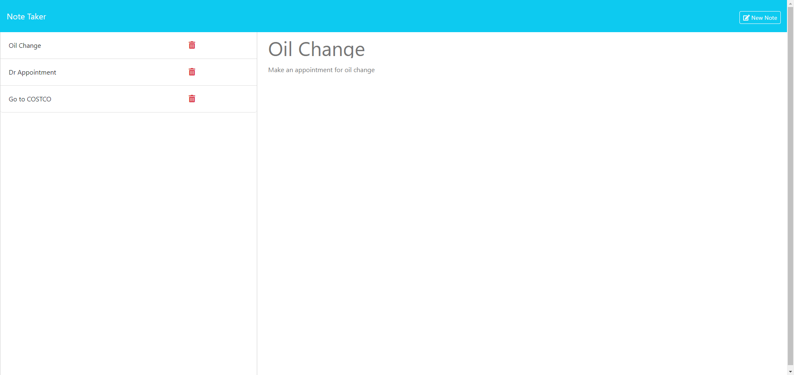
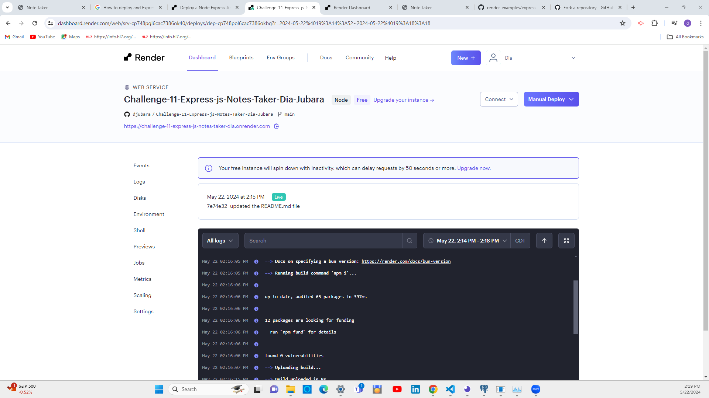

  > # Notes Taker Application

  > 

  > ## Table of Contents

  1. [Description:](#description)
  2. [Installation:](#installation)
  3. [Usage:](#usage)
  4. [How to Contribute:](#how-to-contribute)
  5. [License Agreement:](#license-agreement)
  6. [Test Instructions:](#test-instructions)
  7. [Questions:](#questions)

  > ## Description

  This application will use an Express.js to create and delete notes.

> ## User Story

```md
AS A small business owner
I WANT to be able to write and save notes
SO THAT I can organize my thoughts and keep track of tasks I need to complete
```

> ## Acceptance Criteria

```md
GIVEN a note-taking application
WHEN I open the Note Taker
THEN I am presented with a landing page with a link to a notes page
WHEN I click on the link to the notes page
THEN I am presented with a page with existing notes listed in the left-hand column, plus empty fields to enter a new note title and the note’s text in the right-hand column
WHEN I enter a new note title and the note’s text
THEN a "Save Note" button and a "Clear Form" button appear in the navigation at the top of the page
WHEN I click on the Save button
THEN the new note I have entered is saved and appears in the left-hand column with the other existing notes and the buttons in the navigation disappear
WHEN I click on an existing note in the list in the left-hand column
THEN that note appears in the right-hand column and a "New Note" button appears in the navigation
WHEN I click on the "New Note" button in the navigation at the top of the page
THEN I am presented with empty fields to enter a new note title and the note’s text in the right-hand column and the button disappears
```

  > ## Screen Shot

  

  

  > ## Installation

  1. Clone Repository.
  2. Install Dependencies.
  3. Run Server with `node server.js`.

  > ## Usage

  To take and delete notes.
  
  > ## How to Contribute

  Create a pull request or issue.
  
  > ## License Agreement

 This license is subject to the MIT agreement.

  > ## Test Instructions

  N/A.
  
  > ## Questions

  If you have any question please visit my GitHub at (<https://github.com/djubara>) or send an email to <djubara@hotmail.com>
